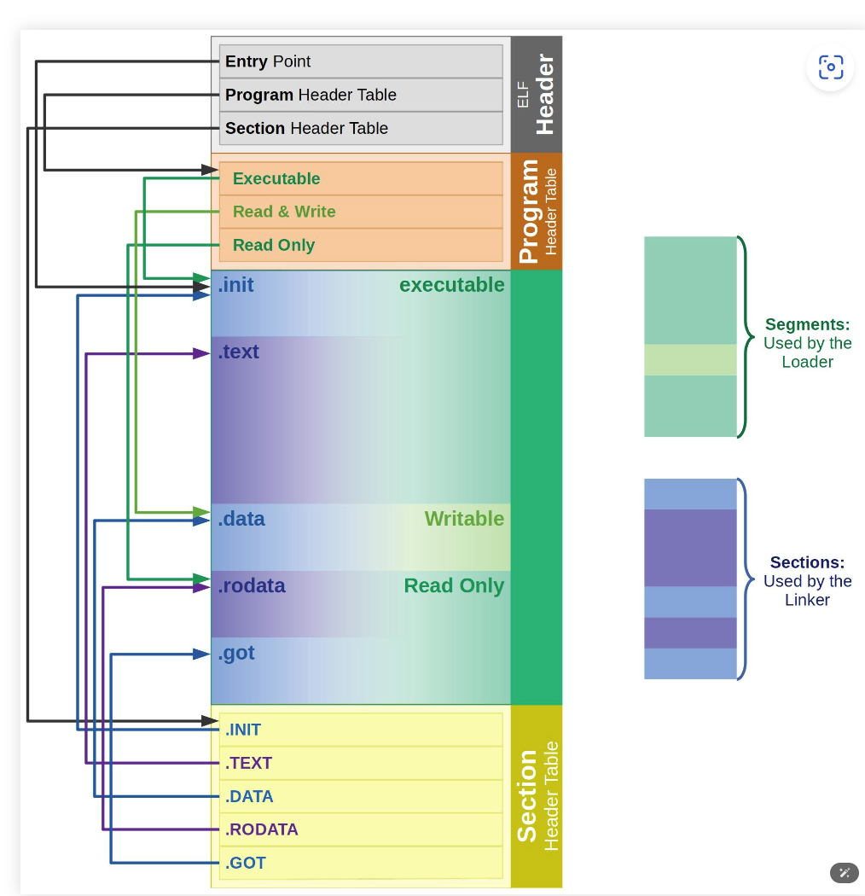
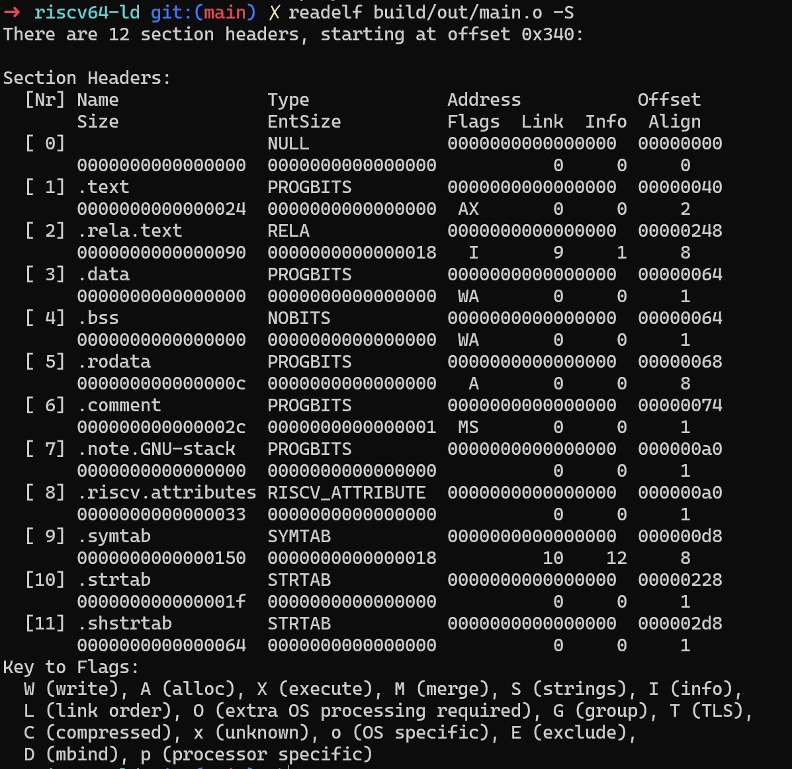

# 开发一个链接器(一): 实现ELF文件的读取和解析

## ELF文件解析
如图所示，ELF文件的格式如图所示，其中`section header table`是一个`Shdr`结构体组成的数组，然后`elf header`中的` e_shoff `字段描述`section header table`在文件中的byte的偏移量，`e_shnum`记录table中的entry数量，`e_shentsize`记录每一个entry的byte的大小。


- 使用`readelf -S`查看完整的段表结构：

```shell
readelf -s a.o  # 查看ELF文件中的符号表
```




